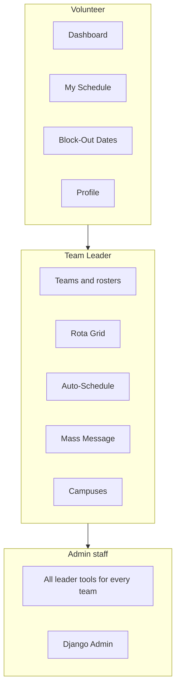

# Ministry Manager — Operations Guide

This guide explains how to set up the system, staff volunteer teams, and how each role uses the application day to day.

## Roles and permissions

Ministry Manager has three permission levels. In the app, **planners** are called **Team Leaders**.

| Role | How it is assigned | Access |
|------|-------------------|--------|
| **Volunteer** | Automatic for every new user | Dashboard, My Schedule, Block-Out Dates, Profile |
| **Team Leader** (planner) | Admin adds user to the **TeamLeader** group *and* assigns them as leader on specific teams | Everything volunteers have, plus leader tools (see below) |
| **Admin** | Django **staff** flag (`is_staff`) on the user account | Full leader access for **all** teams, plus Django Admin at `/admin/` |

### Do planners have more access than volunteers but less than admin?

**Yes.** Team Leaders sit in the middle:

- **More than volunteers:** They can manage rosters, build the schedule (rota), run auto-schedule, send mass messages, and edit campuses/service times in the main app.
- **Less than admin:** They only manage teams where they are listed as a **leader**. They cannot use Django Admin unless they are also marked as staff. They cannot change system-wide settings, user passwords, or data outside their teams (unless staff grants broader access).

The **Admin** auth group exists for labeling, but **staff status** is what unlocks Django Admin and unrestricted access in the app.



---

## Initial admin setup

Run these once when standing up a new environment (or after deploy):

```bash
python manage.py create_db      # local only — creates PostgreSQL database
python manage.py migrate
python manage.py setup_groups   # auth groups + default teams + campus/service time
python manage.py createsuperuser
```

Optional maintenance commands:

```bash
python manage.py setup_teams              # (re)create default ministry teams
python manage.py setup_services           # campus + recurring service times
python manage.py setup_services --extend  # add more future service dates
python manage.py generate_occurrences --weeks=12
```

### Admin checklist

1. **Create a superuser** — first login account with full access.
2. **Confirm church settings** — `/admin/core/churchsettings/` (name, timezone, reminder timing).
3. **Confirm campus and service times** — `/admin/campuses/` or **Campuses** in the app. Default seed creates one campus (from `CHURCH_NAME` in `.env`) and your recurring service pattern.
4. **Generate service occurrences** — concrete dates on the calendar for scheduling (`generate_occurrences` or **setup_services**).
5. **Confirm default teams** — Greeters, Coffee, Tech, etc. (`setup_teams`). Adjust roles and slot counts in admin or **Teams**.
6. **Configure Twilio** (optional) — set `TWILIO_*` env vars for SMS; email uses Django email backend.
7. **Start Celery worker and beat** (production) — required for auto-schedule jobs, reminders, and mass messaging.
8. **Create user accounts** — see [Adding volunteers](#adding-volunteers).
9. **Promote team leaders** — add users to **TeamLeader** group and assign them on each team’s **Leaders** field.

---

## Adding volunteers

Volunteers are Django **users** with an automatic **VolunteerProfile**. There are three ways to add them:

### 1. Self-registration (recommended for volunteers)

1. User visits `/accounts/register/`.
2. They create a username, name, email, and password.
3. A **VolunteerProfile** is created automatically and they are placed in the **Volunteer** group.

They can immediately set preferences on **Profile** but are **not** on any team until a leader adds them to a roster.

### 2. Django Admin (recommended for bulk or staff-created accounts)

1. Go to `/admin/accounts/user/add/`.
2. Enter username, name, email, password.
3. Save — profile and Volunteer group are created via signal.

Optionally set phone, notification preferences, skills, and certifications under **Volunteer profiles**.

### 3. Invite flow (manual today)

Create the account in admin, then send the person their username and a password reset link (password reset can be configured separately; not built into Phase 1 UI).

### Adding a volunteer to a team

Being a user is not enough to be scheduled — they must be on a **team roster**:

1. Team Leader or Admin opens **Teams** → select team → **Roster**.
2. Choose the volunteer from the dropdown and click **Add**.

For auto-scheduling to consider someone, they must also:

- Be an **active** member of the team
- Meet any **required skills** or **valid certifications** on the role (configured in admin)
- Not have a **block-out** on that date
- Not exceed their **serving frequency** preference

Skills and certifications are assigned in Django Admin under **Volunteer skills** and **Volunteer certifications**.

---

## What planners must do to staff their groups

Staffing a service is a repeating workflow. Planners (Team Leaders) should follow these steps before each scheduling period (e.g. monthly or quarterly).

### 1. Prepare the calendar

- Confirm **service occurrences** exist for the dates you are scheduling (`setup_services` / `generate_occurrences`).
- If your church adds block-out seasons (holidays, etc.), remind volunteers to mark **Block-Out Dates** — planners cannot edit another person’s block-outs in the app today.

### 2. Maintain team rosters

For each team you lead (**Teams** → **Roster**):

- Add new volunteers who should serve on that team.
- Remove people who have stepped down.
- Add or adjust **roles** (e.g. Door Greeter, Sound Engineer) and **slots per service** — how many people needed each week.

### 3. Define requirements (admin or staff)

In Django Admin, for each **Team role** optionally set:

- **Required skills** — volunteer must have matching skill records
- **Required certifications** — e.g. background check, must be current

Without these, auto-schedule only checks team membership, block-outs, frequency, and conflict rules.

### 4. Build the schedule

Two approaches (often combined):

**Auto-schedule** (**Auto-Schedule** in sidebar):

1. Choose start and end dates.
2. Run auto-schedule — fills empty slots using preferences, block-outs, skills, certifications, and load balancing.
3. Review results on **Rota Grid**.

**Manual rota** (**Rota Grid**):

1. Open the week view.
2. For each team/role slot, pick a volunteer from the dropdown.
3. The system prevents assigning one person to two teams at the same service time.

### 5. Review gaps

- **Dashboard** shows unfilled slot counts for leaders.
- **Rota Grid** shows “Unfilled” where no volunteer was assigned.
- Celery sends **unfilled slot alerts** to team leaders by email (when worker/beat are running).

Fill gaps manually, adjust rosters, or re-run auto-schedule after roster changes.

### 6. Notify the team

- Assignment and reminder emails/SMS go out automatically when Celery and Twilio/email are configured.
- Use **Mass Message** to broadcast to a whole team (email and/or SMS based on each volunteer’s opt-in settings).

### 7. Track responses

- Volunteers RSVP via links in email/SMS (accept or decline without logging in).
- Declines notify team leaders by email.
- Check **My Schedule** / admin assignments for RSVP status.

### Staffing checklist (per scheduling run)

| Step | Owner | Done when |
|------|-------|-----------|
| Service dates generated | Admin | Occurrences exist through target end date |
| Rosters current | Team Leader | Every scheduled role has eligible members |
| Skills/certs current | Admin | Required credentials assigned and not expired |
| Schedule built | Team Leader | Rota has no unfilled slots (or gaps acknowledged) |
| Volunteers notified | System | Reminders sent; mass message if needed |
| RSVPs reviewed | Team Leader | Declines replaced or subs found |

---

## How volunteers interact with the system

### Login and profile

1. Sign in at `/accounts/login/` (or register first).
2. Open **Profile** to set:
   - Contact info (name, email, phone)
   - **Email / SMS notification** opt-in
   - **Serving frequency** (how often they want to serve)
   - **Preferred service times**
   - Notes for planners

Accurate profile data directly improves auto-scheduling.

### Block-out dates

1. Open **Block-Out Dates**.
2. Click any date to **block** it (turns red) — saved immediately.
3. Click again to **unblock**.

Blocked dates exclude the volunteer from auto-schedule for that day.

### View schedule

1. **Dashboard** — upcoming shifts and RSVP status.
2. **My Schedule** — full list of assignments.

### Respond to assignments

When scheduled, volunteers receive email and/or SMS (if opted in) with:

- Shift details (team, role, date, campus)
- **Accept** and **Decline** links (one click, no login)

If they decline, team leaders are notified to find coverage.

### What volunteers cannot do

- View or edit other people’s schedules
- Manage teams, rosters, or the rota
- Run auto-schedule or mass messaging
- Access Django Admin

---

## Leader vs admin — quick reference

| Action | Volunteer | Team Leader | Admin (staff) |
|--------|-----------|-------------|---------------|
| Edit own profile | Yes | Yes | Yes |
| Block-out dates | Own only | Own only | Own only |
| View own schedule | Yes | Yes | Yes |
| Manage team roster | No | Own teams only | All teams |
| Edit teams/roles | No | Own teams only | All teams |
| Rota grid | No | Yes | Yes |
| Auto-schedule | No | Yes | Yes |
| Mass message | No | Own teams only | All teams |
| Campuses / service times | No | Yes | Yes |
| Django Admin | No | No | Yes |
| Create users | No | No | Yes (admin) |

---

## Default teams (seed data)

`setup_teams` creates these ministry teams with predefined roles:

- **Greeters** — Door Greeter, Usher
- **Coffee** — Barista, Counter Help
- **Roadies** — Stage Hand, Runner
- **Setup** — Setup Crew
- **Teardown** — Teardown Crew
- **Kid City** — Small Group Leader, Check-In, Floater
- **Tech** — Sound Engineer, Presentation, Lighting
- **Worship Team** — Vocals, Band, Worship Leader

Edit names, slot counts, and roles in **Teams** or Django Admin to match your church.

---

## Related documentation

- [README.md](../README.md) — installation, environment variables, deployment
- Django Admin: `/admin/` — skills, certifications, users, assignments, notifications
